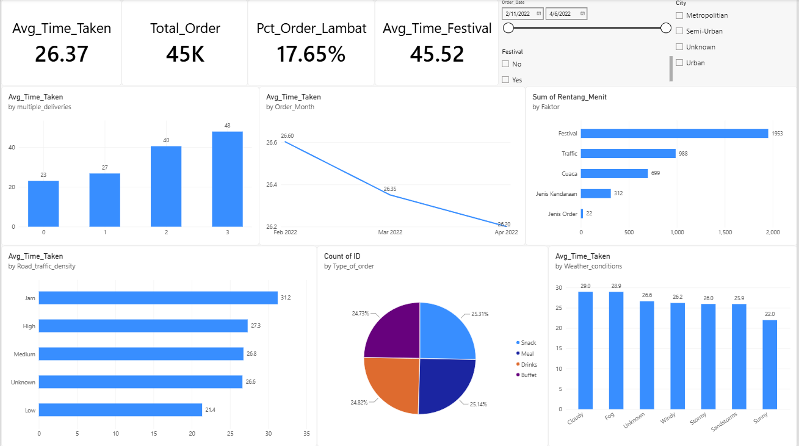

# Delivery Time Analysis & Courier Efficiency
Take Home Test

TAKE HOME TEST — DATA ANALYST
Delivery Time Analysis
& Courier Efficiency
Food Delivery Platform Case Study — Zomato Dataset
45,584 orders · 20+ cities in India · February–April 2022
Prepared as part of the Data Analysis & Business Intelligence Bootcamp
Table of Contents

## 1. Background & Problem Statement
The company is an on-demand food delivery marketplace operating across 20+ cities in India, connecting restaurants, customers, and partner couriers (gig workers) through an app. The current average delivery time is 26.3 minutes, but it varies quite widely (10–54 minutes, standard deviation of 9.4 minutes). This uncertainty in delivery time can hurt customer satisfaction, while at the same time the company applies an order-batching strategy (multiple_deliveries) to reduce operational cost per delivery — a trade-off whose optimal point has not yet been measured.

### PROBLEM STATEMENT
Delivery times vary significantly, and it is not yet clear which operational factors drive this the most, making it difficult for the company to set the right courier allocation and readiness policies — especially during high-demand periods such as festivals — without sacrificing service quality for customers.

## 2. Analysis Objectives & Scope

### Analysis Objectives
●	Identify and rank the factors that most influence delivery time, distinguishing factors the company can control from external factors it must anticipate.

●	Find the trade-off point in the order-batching strategy (multiple_deliveries) — how far adding orders per courier stays cost-efficient before significantly affecting delivery time.

●	Measure the impact of high-demand periods (festivals) on delivery time, as a basis for resource-readiness planning.

●	Develop actionable, data-driven operational recommendations, without assuming individual courier performance and without claiming financial impact.

### Scope & Limitations
●	The analysis is operational/logistical in nature and excludes financial impact (cost, revenue, commission), since the dataset provides no price column.

●	Findings are correlational, not strictly causal, especially for interrelated factors.

●	Delivery_person_ID is not used for individual courier performance analysis, given indications that this ID is a system-generated code combination.

●	Conclusions for the City = Semi-Urban category are treated with caution due to its small sample (164 of 45,584 rows, 0.4%).

●	The dataset is likely synthetic/educational, so insights are positioned as a business case simulation rather than a claim about real business conditions.

## 3. Data Understanding

### Business Model
Based on the data structure, this is a three-sided marketplace business connecting three actors: restaurants (supply, represented via restaurant coordinates), customers (demand, via delivery-location coordinates), and partner couriers (logistics, gig workers with their own vehicle and rating — not full-time employees).
Additional finding: Delivery_person_ID follows the pattern [CityCode]RES[number]DEL[number] — indicating this ID is a system-generated code combination, not a persistent individual courier identity (supported by the finding that 1,288 of 1,320 "couriers" are recorded as operating across more than one city category, which makes no sense for real couriers). Geographic coverage reaches 21+ Indian cities (Mumbai, Bangalore, Chennai, Kolkata, Pune, and others), far broader than implied by the City column, which contains only 3 categories (Metropolitian/Urban/Semi-Urban).

### Dataset Overview

</img>

### Signs the Dataset Is Synthetic
●	Type_of_order is split almost perfectly evenly (Snack 25.3% / Meal 25.1% / Drinks 24.8% / Buffet 24.7%) — unusual for organic order data.

●	Daily average delivery time alternates by odd/even calendar day (even days 28.67 min vs odd days 24.76 min) — a pattern that could not occur naturally in real business operations.

●	There is not a single financial column (price, delivery fee, commission) — the dataset is purely operational/logistical.

## 4. Data Preprocessing
### Data Quality Issues Found

</img>

### Derived Features (Feature Engineering)
●	Distance_km — straight-line (haversine) distance from restaurant to delivery location. Mean 9.72 km, range 1.47–20.97 km.

●	Prep_Time_min — gap between order placed and courier pickup time ("kitchen time").

●	Order_Hour and Order_Weekday — order hour and day, for peak-time pattern analysis.

●	Age_flag_under18 — a transparent flag without removing data.

### Additional Data-Quality Finding: Anomalous Cluster
228 rows with Festival = missing were found to not be missing at random — their delivery times were remarkably uniform and far faster (10–14 minutes, std of only 1.23) than any other group, spread evenly across the entire data period. This pattern deviates significantly and is unlikely to represent normal deliveries, so these 228 rows were excluded from the main analysis (not imputed).
### DATASET READY FOR EDA
45,356 rows — after excluding 228 anomalous cluster rows from the 45,584 rows produced by full cleaning.

## 5. Exploratory Data Analysis
### 5.1 Factor Ranking by Influence
Categorical factors are measured by the range between the fastest and slowest category's average delivery time:

</img>

Numerically (correlation with Time_taken), ranked by strength:

</img>

multiple_deliveries is the strongest numerical factor and the only one fully within the company's control through order-allocation policy.

### 5.2 Trade-off Point: Multiple Deliveries per Courier

</img>

From 0→1 additional order, the time cost is small (+3.76 min) — still reasonable for efficiency. But once a courier reaches 2 additional orders, delivery time jumps +13.69 minutes at once — far larger than the increase before or after it. The clear trade-off point: 1 additional order (2 orders total per trip) is the safe limit; beyond that, courier "savings" start to sacrifice delivery speed significantly.

### 5.3 External Factors: Traffic and Weather

</img>

Traffic Jam adds ~10 minutes compared to Low. Cloudy and Fog weather are slowest (~29 min) — notable because they are slower than Stormy/Sandstorms, likely because low visibility slows couriers down more than the extreme weather itself. Both factors have a real effect but sit outside the company's direct control — their value lies in more realistic ETA estimation, not prevention.

### 5.4 Festival: A Critical Moment

</img>

A gap of 19.54 minutes — nearly double. This effect holds consistently across all traffic levels (42–47 minutes across every traffic category during festivals), suggesting the main cause is a surge in order volume that overwhelms kitchen and courier capacity simultaneously — not just heavier traffic. The implication: the festival solution lies in capacity readiness (backup couriers), not route optimization.

## 6. Insight & Interpretation
### 1. Order-batching trade-off point
Delivery time jumps +13.69 minutes once a courier carries 2 additional orders. Order batching stays efficient up to 1 additional order; beyond that, courier savings start to hurt service quality disproportionately — not a gradual decline, but a sharp jump. This is the only major factor fully within the company's control.
### 2. Festival = a capacity shock, not just traffic
The festival effect (+19.54 min) is consistent across all traffic levels — pointing the solution toward capacity (backup couriers), not routing.
### 3. External factors: must be anticipated, not eliminated
Traffic and weather have a real effect but are outside the company's control. Their value lies in prediction (dynamic ETA), not prevention.
### 4. Vehicle-type anomaly
Motorcycles (27.6 min) are slower than scooters/electric scooters (~24.5 min) — counterintuitive. Likely an assignment bias (motorcycles assigned to longer distances/more complex orders), rather than the vehicle's speed itself. Needs further investigation before informing fleet policy.
### 5. Courier rating and age: correlation, not causation
Higher rating correlates with faster delivery (−0.332); older age correlates with slower delivery (+0.290). The direction of causality cannot be confirmed from this data — should not be used to directly drive HR policy without a separate causal study.

## 7. Interactive Dashboard
The dashboard was built in Power BI as a single page, following the storytelling flow: overview (KPIs) → factor ranking → controllable factor (multiple deliveries) → external factors (traffic, weather) → order composition. It includes slicers for date range, city type, and festival status.

</img>

Four KPI cards display the average delivery time (26.37 min), total orders (45K), the percentage of late orders above 35 minutes (17.65%), and the average delivery time during festivals (45.52 min) — all consistent with the EDA results in the previous section.

## 8. Business Insight Recommendations

</img>

Important note: because this dataset has no cost/revenue data, the impact levels above are qualitative (High/Medium/Low, based on statistical strength and ease of execution), not financial estimates. Calculating financial impact (e.g., estimated cost savings) requires additional data not currently available in this dataset.

## 9. Limitations & Conclusion
### Limitations
●	All findings are correlational, not strictly causal.

●	Delivery_person_ID is not used to claim individual courier performance, since the ID does not appear to be a consistent courier identity.

●	Conclusions for the City = Semi-Urban category are statistically weak (0.4% sample).

●	228 anomalous-cluster rows (Festival = missing with a deviant pattern) were excluded from the main analysis.

●	The dataset shows signs of being synthetic (courier ID pattern, an unusually even order-type distribution, and odd/even date alternation) — insights are positioned as a business case simulation, not a claim about real business conditions.

●	There is no cost/revenue data in the dataset — business recommendation impact is stated qualitatively, not as a financial estimate.

### Conclusion
Order-allocation policy (capping additional orders at 1) and courier capacity readiness ahead of festivals are the two levers with the biggest impact and the lowest implementation effort, making them the top execution priority. External factors such as traffic and weather remain valuable for building more realistic ETAs for customers, even though they cannot be eliminated entirely. The interactive dashboard built alongside this analysis supports ongoing monitoring of these factors, enabling the operations team to make data-driven decisions directly.
